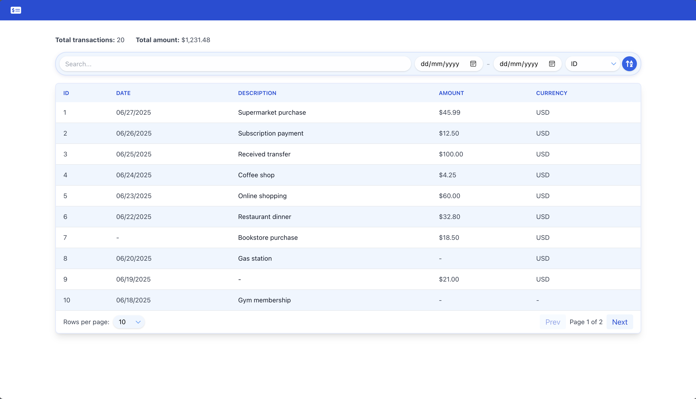
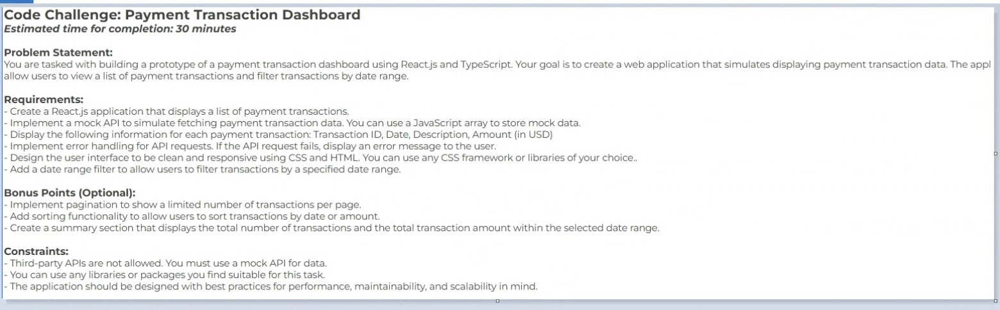

# Code Challenge: Payment Transaction Dashboard

This project is a fullstack application that includes a Node.js backend and a
React frontend. Its goal is to demonstrate seamless integration between both
environments and provide a simple local development setup.

## Tools

- **Frontend:** [React](https://react.dev/) +
  [TypeScript](https://www.typescriptlang.org/) +
  [Tailwind CSS](https://tailwindcss.com/) +
  [Font Awesome](https://fontawesome.com/)
- **Backend:** [Node.js](https://nodejs.org/) +
  [TypeScript](https://www.typescriptlang.org/) +
  [Express](https://expressjs.com/)

## Preview



---

## Steps to start the project locally

### 1. Clone the repository

```bash
git clone https://github.com/nicobxez/code-challenge-payment-transaction-dashboard.git
cd code-challenge-payment-transaction-dashboard
```

### 2. Quick Start (Recommended)

Make sure you have execution permissions:

```bash
chmod +x start-all.sh
```

Then, simply run:

```bash
npm run start-all
```

This command will install dependencies and launch both the backend and frontend
automatically.

If you prefer, you can also start each service independently by following the
steps below.

### a. Start the backend

1. Go to the transaction-api folder:
   ```bash
   cd transaction-api
   ```
2. Install dependencies:
   ```bash
   npm install
   ```
3. Start the server:
   ```bash
   npm run start
   ```
   The backend should be running at `http://localhost:3001` (or the configured
   port).

### b. Start the frontend

1. Open a new terminal and go to the transaction-ui folder:
   ```bash
   cd transaction-ui
   ```
2. Install dependencies:
   ```bash
   npm install
   ```
3. Start the application:
   ```bash
   npm run start
   ```
   The frontend should be available at `http://localhost:3000` (or the
   configured port).

---

Done! Now you can access the application from your browser.

## Challenge


